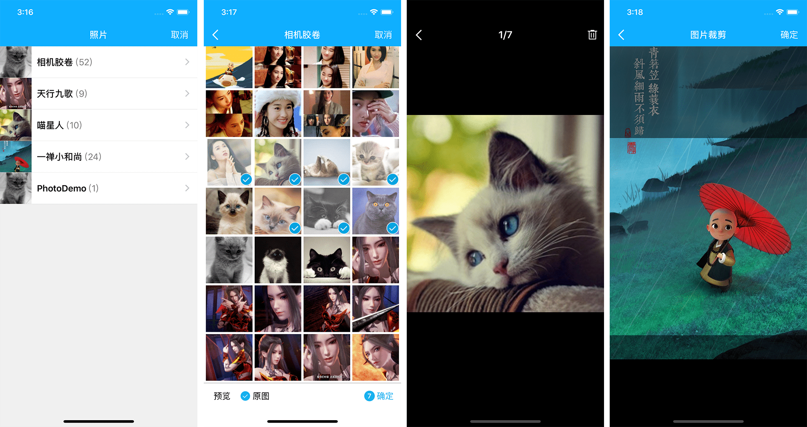

# MMImagePickerCheeryLau

[](https://raw.githubusercontent.com/CheeryLau/MMImagePicker/master/LICENSE)&nbsp;
[](http://cocoapods.org/pods/MMImagePicker)&nbsp;
[](http://cocoapods.org/pods/MMImagePicker)&nbsp;



`MMImagePicker`基于`AssetsLibrary`框架的图片选择器：支持多选、单选、对图片进行裁剪、选择原图、可预览。若想使用基于`Photos`框架的图片选择器，可选择[MMPhotoPicker](https://github.com/CheeryLau/MMPhotoPicker)。


## 属性

```objc
MMImagePickerController属性介绍：
   
// 主色调[默认蓝色]
@property (nonatomic, strong) UIColor *mainColor;
// 是否回传原图[可用于控制图片压系数]
@property (nonatomic, assign) BOOL isOrigin;
// 是否显示原图选项[默认NO]
@property (nonatomic, assign) BOOL showOriginImageOption;
// 是否只选取一张[默认NO]
@property (nonatomic, assign) BOOL singleImageOption;
// 是否选取一张且需要裁剪[默认NO]
@property (nonatomic, assign) BOOL cropImageOption;
// 裁剪的大小[默认方形、屏幕宽度]
@property (nonatomic, assign) CGSize imageCropSize;
// 最大选择数目[默认9张]
@property (nonatomic, assign) NSInteger maximumNumberOfImage;
// 代理
@property (nonatomic, assign) id<MMImagePickerDelegate> delegate;
```

## 代理

```objc
@protocol MMImagePickerDelegate <NSObject>

@optional
/**
 info释义:
 返回的媒体数据是数组，数组单元为字典，字典中包含以下数据：
 
 资源类型 ALAssetPropertyType
 位置方向 ALAssetPropertyLocation
 原始图片 UIImagePickerControllerOriginalImage
 原件路径 UIImagePickerControllerReferenceURL
 
 */
- (void)mmImagePickerController:(MMImagePickerController *)picker didFinishPickingMediaWithInfo:(NSArray<NSDictionary *> *)info;
- (void)mmImagePickerControllerDidCancel:(MMImagePickerController *)picker;

@end
```
  
## 使用

1. `pod "MMImagePicker"` ;
2. `pod install` / `pod update`;
3. `#import <MMImagePicker/MMImagePickerController.h>`.

```objc
MMImagePickerController *mmVC = [[MMImagePickerController alloc] init];
// 代理
mmVC.delegate = self;  
// 最大图片选择数量 
mmVC.maximumNumberOfImage = 9; 
// 显示原图选项
mmVC.showOriginImageOption = YES;
UINavigationController *mmNav = [[UINavigationController alloc] initWithRootViewController:mmVC];
[self.navigationController presentViewController:mmNav animated:YES completion:nil];
```

```objc
#pragma mark - MMImagePickerDelegate
- (void)mmImagePickerController:(MMImagePickerController *)picker didFinishPickingMediaWithInfo:(NSArray *)info
{
     NSLog(@"%@",info);
}

 - (void)mmImagePickerControllerDidCancel:(MMImagePickerController *)picker
{
     NSLog(@"Cancel");
}
```

## 注意

1. 需要在Info.plist中添加隐私授权：`Privacy - Photo Library Usage Description`；
2. 如果相册名称需要根据手机语言环境显示相应语言，需要在Info.plist中设置`Localized resources can be mixed` 为 `YES`。

## 后记

如有问题，欢迎给我[留言](https://github.com/CheeryLau/MMImagePicker/issues)，如果这个工具对你有些帮助，请给我一个star，谢谢。😘😘😘😘

💡 💡 💡 
欢迎访问我的[主页](https://github.com/CheeryLau)，希望以下工具也会对你有帮助。

1、自定义视频采集/图像选择及编辑/音频录制及播放等：[MediaUnitedKit](https://github.com/CheeryLau/MediaUnitedKit)

2、类似滴滴出行侧滑抽屉效果：[MMSideslipDrawer](https://github.com/CheeryLau/MMSideslipDrawer)

3、图片选择器基于AssetsLibrary框架：[MMImagePicker](https://github.com/CheeryLau/MMImagePicker)

4、图片选择器基于Photos框架：[MMPhotoPicker](https://github.com/CheeryLau/MMPhotoPicker)

5、webView支持顶部进度条和侧滑返回:[MMWebView](https://github.com/CheeryLau/MMWebView)

6、多功能滑动菜单控件：[MenuComponent](https://github.com/CheeryLau/MenuComponent)

7、仿微信朋友圈：[MomentKit](https://github.com/CheeryLau/MomentKit)

8、图片验证码：[MMCaptchaView](https://github.com/CheeryLau/MMCaptchaView)

9、源生二维码扫描与制作：[MMScanner](https://github.com/CheeryLau/MMScanner)

10、简化UIButton文字和图片对齐：[UUButton](https://github.com/CheeryLau/UUButton)

11、基础组合动画：[CAAnimationUtil](https://github.com/CheeryLau/CAAnimationUtil)

